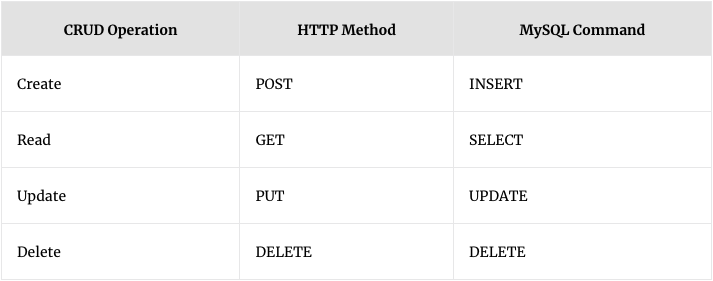

# 📘 MySQL Basic Commands

A reference guide for setting up a basic databse using MySQL

---


### MySQL:

- You can connect to SQL server using VScode extension or the standalone workbench


# Creating a database:

```bash
Create DATABASE your_database_name;
```

# Creating a table:

Syntax:
```bash
CREATE TABLE <table_name> (
    <column1_name> <INT| TEXT | VARCHAR(n)| CHAR(n)| ENUM(...) {NOT NULL}>
    <column2_name> <INT| TEXT | VARCHAR(n)| CHAR(n)| ENUM(...) {NOT NULL}>
);
```

The line
```bash
NOT NULL
```
[Optional] States that the value for the column cannot NULL (i.e. cannot be blank)

Example:
```bash
CREATE TABLE Pokemon (
  id INT PRIMARY KEY AUTO_INCREMENT,
  owner_id INT NOT NULL,
  dex_num INT NOT NULL,
  hp INT,
  atk INT,
  def INT
);
```

The line with:
```bash
INT PRIMARY KEY AUTO_INCREMENT
```

It makes it where the value of the column "id" will increase by 1 automatically
whenever a new record/row is added.

# Renaming a Table
```bash
RENAME TABLE <old_name> TO <new_name>;
```

# Inserting values to Table

Syntax:
```bash
INSERT INTO <table_name> (<col1>, <col2>, <col3>, ...) VALUES
(<col1_newvalue>, <col2_newvalue>, <col3_newvalue>, ...),
```

Example:
```bash
INSERT INTO Player (name, level) VALUES
('Ash', 1),
('Misty', 21),
('Brock', 30);
```

# Altering Table columns

The main command/statement used will be to choose the table to alter:
- [Run this command first before doing any of the below]
```bash
ALTER_TABLE <table_name>;
```

`<constraints>` can be `NOT NULL` or `UNIQUE` or `PRIMARY KEY`

Adding:
```bash
ADD COLUMN <column_name> <data_type> <constraints>;
```

Modifying (datatype or constraints):
```bash
MODDIFY COLUMN <column_name> <new_data_type> <constraints>;
```

Changing (name and datatype):
```bash
CHANGE COLUMN <old_name> <new_name> <new_data_type>;
```

Dropping/Deleting:
```bash
DROP COLUMN <column_name>;
```

# Querying Data

Showing Table:
Syntax:
```bash
SELECT * FROM <table_name>;
```

Selecting Columns to print:
Syntax:
```bash
SELECT <col1_name>, <col2_name> FROM <table_name>;
```

Selecting Distinct Columns to Print:
Syntax:
```bash
SELECT DISTINCT <column1, column2, ...>
FROM <table_name>;
```

Updating Data:
Syntax:
```bash
UPDATE <table_name> SET <column_name> = <value> WHERE <another_column> = <value>; 
```
```bash
UPDATE table_name
SET column_name = column_name <operator> value
WHERE some_condition;
```

Example:
```bash
UPDATE Player SET level = 31 WHERE name = 'Misty'; 
```

```bash
UPDATE Player SET level = level - 5 WHERE name = 'Misty'; 
UPDATE Player SET level = level * 5 WHERE name = 'Misty';
UPDATE Player SET level = level + 5 WHERE name = 'Misty';
UPDATE Player SET level = level / 5 WHERE name = 'Misty'; 
```

This query will update the "level" column of the "Player" table for the record with the name 'Misty'. It will chnage the age for the row with 'Misty'

Deleting Data:
Syntax:
```bash
DELETE FROM <table_name> WHERE <column_name> = <value>;
```

# Combining Tables

Combing Rows

1. `INNER JOIN`

Syntax:
Two Tables:
```bash
SELECT <table1.colX>, <table2.colX>
FROM <table1_name>
INNER JOIN <table2_name>
ON <table1_.colY> = <table2.colY>;
```

The `SELECT` part will be the columns to be combined for the output

Three Tables:
```bash
SELECT <table1.colX>, <table2.colX>, <table3.colX>
FROM <table1_name>
INNER JOIN departments ON <table1.colY> = <table2.colY>
INNER JOIN projects ON <table2.colY> = <table3.colY>;
```

The second `INNER JOIN` will use the reuslt of the first`INNER JOIN` operation to give an output of the three combined columns as seen in the `SELECT` Statement


2. Ordering

Syntax:
```bash
SELECT <col_name>
FROM <table_name>
ORDER BY <RAND() | ASC | DESC | name>;
```

`SELECT` chooses the column you want to order by.

Direct Sorting:
```bash
SELECT * FROM <table_name> ORDER BY <col> <RAND() | ASC | DESC>;
```

[Multiple Columns]:
```bash
SELECT * FROM <table_name> ORDER BY <col> <RAND() | ASC | DESC>, <col> <RAND() | ASC | DESC>, ...;
```

[By Expression]
```bash
SELECT * FROM <table_name> ORDER BY <col1> * <col2> DESC;
```

# AND/OR/NOT
AND:
```bash
SELECT column1, column2, ...
FROM table_name
WHERE condition1 AND condition2 AND condition3 ...; 
```

OR:
```bash
SELECT column1, column2, ...
FROM table_name
WHERE condition1 OR condition2 OR condition3 ...; 
```

NOT:
```bash
SELECT column1, column2, ...
FROM table_name
WHERE NOT condition; 
```

# Basic Arithmetic

```bash
SELECT SUM(<col_name>) FROM <table_name>;
```
```bash
SELECT AVG(<col_name>) FROM <table_name>;
```
```bash
SELECT COUNT(<col_name>) FROM <table_name>;
```

1. SUM()
This will add up the values in every row in this column

Syntax:
```bash
SELECT SUM(<col_name>) AS <output_col_name> FROM <table_name>
WHERE condition;
```

Example:
```bash
SELECT SUM(Price) AS <output_col_name> FROM Company;
```

2. AVG()

Syntax:
```bash
SELECT AVG(<col_name>) AS <output_col_name> FROM <table_name>
WHERE condition;
```

Example:
```bash
SELECT AVG(Price) AS <output_col_name> FROM Company
WHERE condition;
```

3. COUNT()
This counts the number of rows for this column
Syntax:
```bash
SELECT COUNT(<col_name>) AS <output_col_name> 
FROM <table_name>
WHERE condition;
```

Example:
```bash
SELECT Sum(Price) AS Price 
FROM Company;
```

4. MAX()
The MAX() function returns the largest value of the selected column.

Syntax:
```bash
SELECT MAX(<col_name>) AS <output_col_name>
FROM <table_name>;
```

Example:
```bash
SELECT MAX(height) 
FROM Students;
```

5. MIN()
The MIN() function returns the smallest value of the selected column.

Syntax:
```bash
SELECT MIN(<col_name>) AS <output_col_name>
FROM <table_name>;
```

Example:
```bash
SELECT MIN(height) 
FROM Students;
```

# Limit Queries

Sort by top 3

```bash
SELECT <col_name> <table_name> 
ORDER BY DESC
LIMIT 3;
```

# LIKE operator

This sees if "%<?>%", this will see a match string with ?.

- To see if it starts with <?> use "<?>%"
- To see if it ends with <?> use "%<?>"

```bash
SELECT * FROM User
WHERE username LIKE "%<?>%";
```

# HAVING 
The `HAVING` clause was added to SQL because the `WHERE` keyword cannot be used with aggregate functions.

Syntax:

```bash
SELECT <col_name>
FROM <table_name>
WHERE <condition>
GROUP BY <column_name(s)>
HAVING <condition>
```

# EXISTS

Syntax:
```bash
SELECT <column_name(s)>
FROM <table_name>
WHERE EXISTS
<(SELECT column_name FROM table_name WHERE condition)>; 
```

Example:
The following SQL statement returns TRUE and lists the suppliers with a product price less than 20:
```bash
SELECT SupplierName
FROM Suppliers
WHERE EXISTS 
(SELECT ProductName 
FROM Products 
WHERE Products.SupplierID = Suppliers.supplierID AND Price < 20); 
```
# TIME
Useful for updating the timestamps of the data
- `CURRENT_TIMESTAMP` is "YYYY-MM-DD HH-MM-SS" (string)
- `CURRENT_TIME` is "HH-MM-SS" (string)
- `CURRENT_DATE` is "YYYY-MM-DD" (string)"

Syntax:
```bash
UPDATE <table_name> 
SET time = CURRENT_TIMESTAMP;
```
# GROUP BY

The `GROUP BY` statement groups rows that have the same values into summary rows, like "find the number of customers in each country".

Usually used with aggregrate functions such as `SUM()`, `COUNT()`, `AVG()`, `MAX()`, `MIN()`

```bash
SELECT SUM(Customer_id), Country
FROM Shop
GROUP BY Country;
```